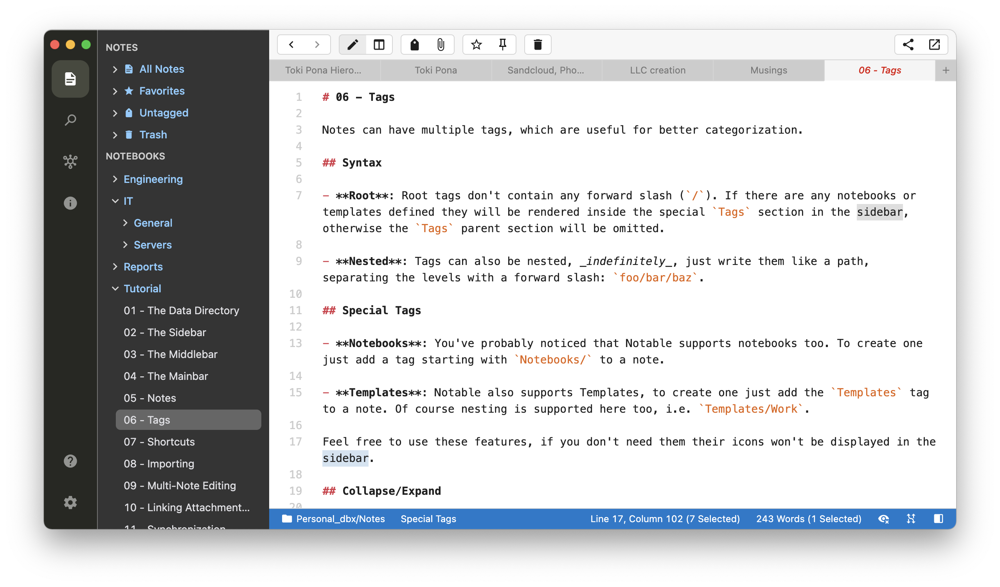
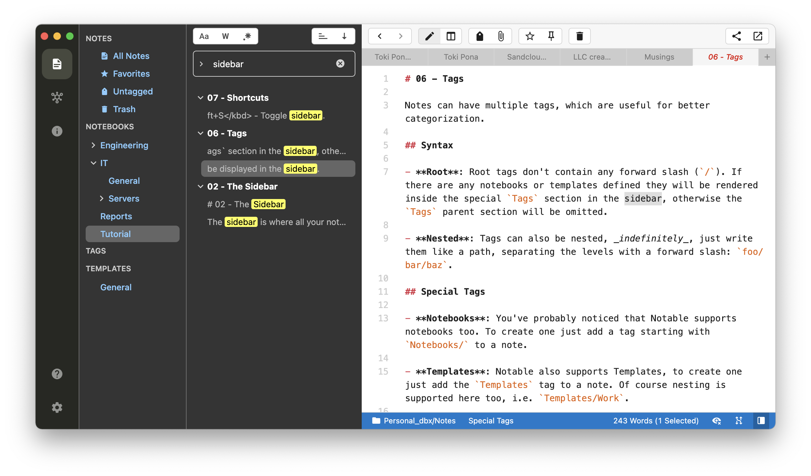

# Noteworthy
This is a theme (and accompanying custom CSS) for the most-excellent markdown note taking app [Notable](https://notable.app).

As of this writing, the theme is tailored to work with Notable `1.0.0-beta.5`.  Likely it will evolve as the beta evolves.

## Screenshots

## Installation
For reference, the `noteworthy.json` file contains all the boilerplate of a bare-bones Notable global settings JSON file, but in reality all you want is the `"noteworthy"` object (located inside the `"themes":"installed"` object).

- In Notable, open your Settings (e.g. on MacOS: Notable -> Preferences -> Settings)
- Theme
    - Click the "Settings Editor" button at the top of the settings screen.
    - Select the `"noteworthy"` object from the `noteworthy.json` file in this repo.
    - Paste it into the `"installed"` object in **your** settings JSON (which is inside the `"themes"` object, in the "Global" tab on the right of the screen).
        - Mind your commas (JSON requires a comment between each object, and disallows a trailing comma).
- CSS
    - Click the "Custom CSS/JS Editor" button at the top of the settings screen.
    - Copy the content of the `noteworthy.css file` into the bottom of the "CSS" panel.
- Close Settings.
- Select the theme from the Notable menu (e.g. on MacOS: Notable -> Preferences -> Theme -> Noteworthy)